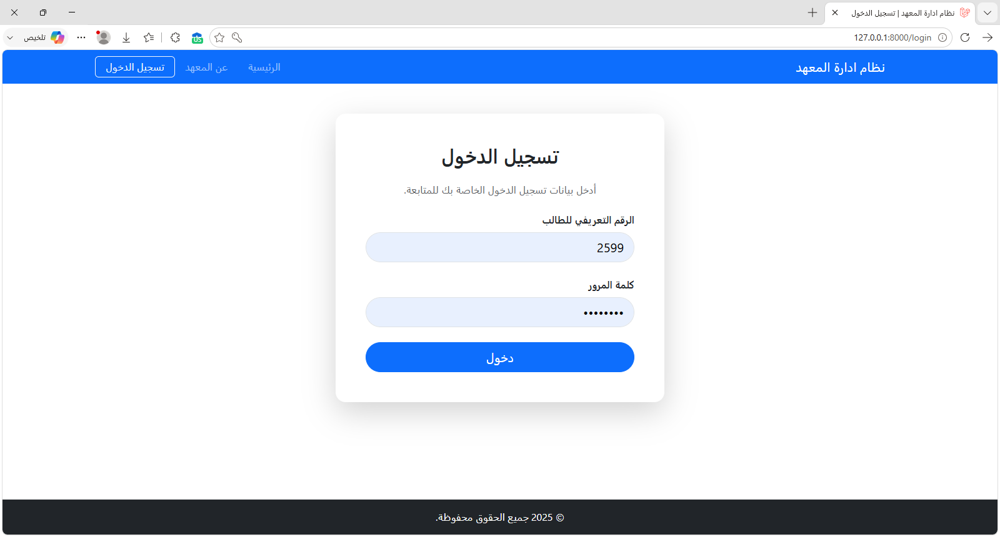
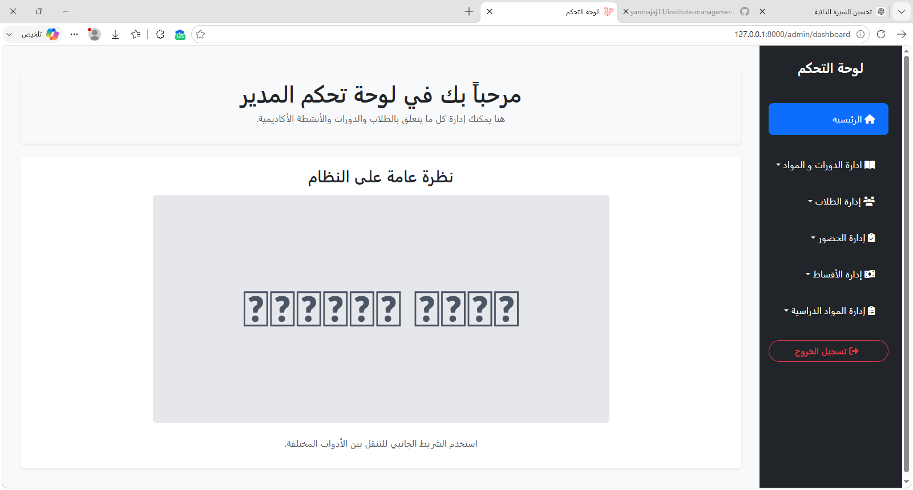
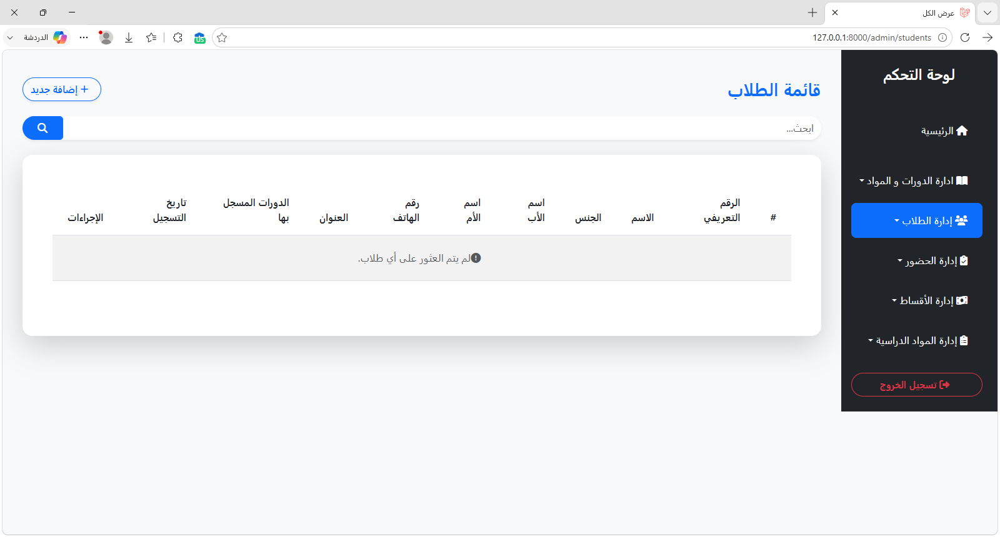
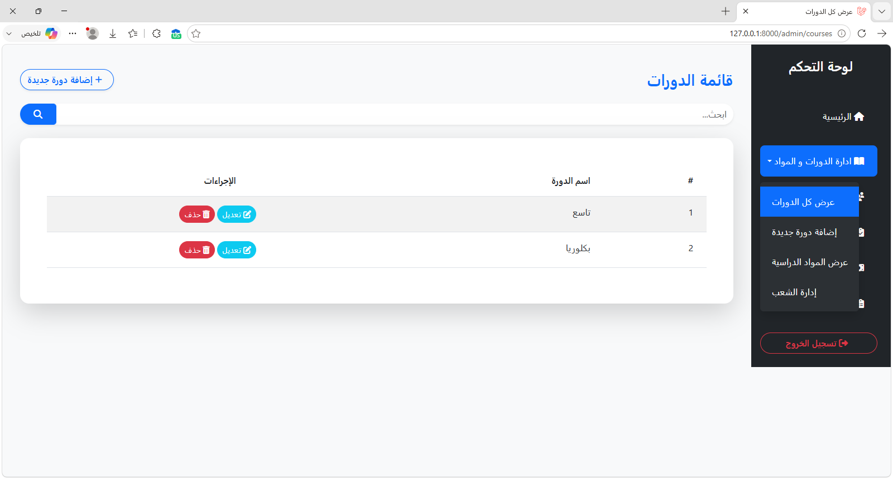
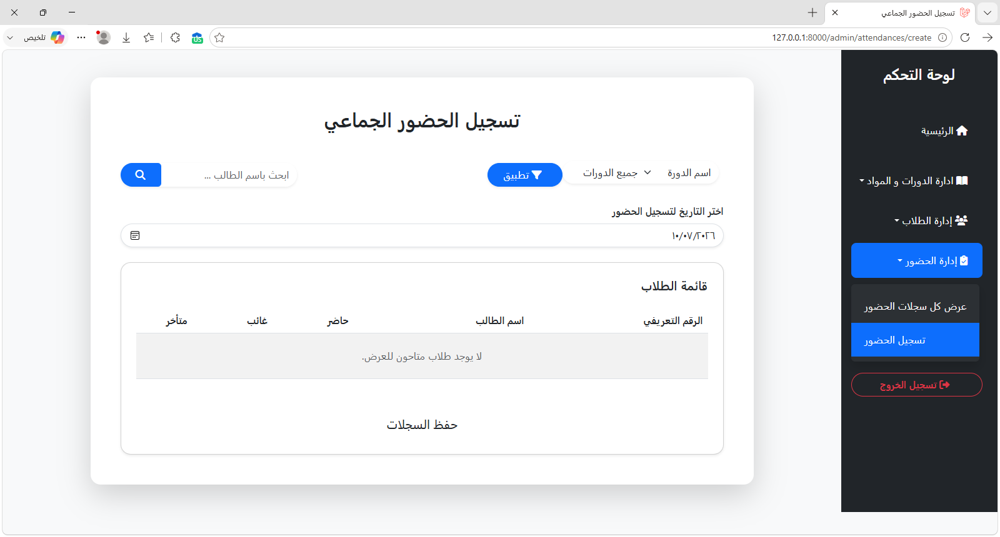

# README - Institute Management System

```markdown
# Institute Management System

A complete Institute Management System developed using Laravel to manage students, courses, attendance, exams, marks, and payments.

## About The Project

Institute Management System is a web-based application designed to help educational institutes manage their daily operations through an organized platform.

The system provides tools for managing students, courses, academic activities, attendance records, exams, marks, and financial transactions.

---

## Features

### Student Management
- Add, edit, and manage students.
- Store student information.
- Track student records.

### Academic Management
- Manage courses.
- Manage subjects.
- Manage sections.
- Track attendance.
- Manage exams and marks.

### Financial Management
- Manage payments.
- Track student fees and financial transactions.

### System Features
- User authentication.
- User roles and permissions.
- Dashboard.
- Responsive interface.
- Organized system structure.

---

## Technologies Used

- PHP
- Laravel
- MySQL
- Blade Template Engine
- Bootstrap
- Livewire
- JavaScript
- HTML
- CSS

---

## Project Architecture

The project was developed using:

- MVC Architecture
- Repository Pattern
- Eloquent ORM
- Laravel Migrations

---

## Database

The database structure was designed using Laravel Migrations with proper relationships between tables using primary and foreign keys.

The system includes relationships between:

- Students
- Courses
- Subjects
- Sections
- Attendance
- Exams
- Marks
- Payments

---

## Screenshots

### Login Page



### Dashboard



### Students Management



### Courses Management



### Attendance Management



---

## Installation

Clone the repository:

```bash
git clone https://github.com/yamnajaj11/institute-management-system.git
cd institute-management-system
composer install
cp .env.example .env
php artisan key:generate
php artisan migrate
php artisan serve
